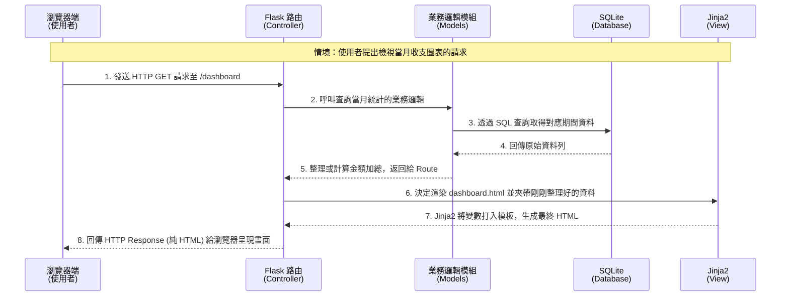

# 系統架構文件 (Architecture) - 個人記帳簿

本文件根據 [PRD.md](PRD.md) 中的功能需求，定義了個人記帳簿系統的技術架構、資料夾結構分配及主要元件交互關係。

## 1. 技術架構說明

本系統採用的技術堆疊（Tech Stack）：
- **後端框架**：Python + **Flask** (輕量化、易於快速開發與迭代)
- **模板引擎**：**Jinja2** (內建於 Flask，適合在網頁端快速渲染動態資料，無須前後端分離)
- **資料庫**：**SQLite** (以單一檔案為基礎的關聯式資料庫，輕量、無須單獨架設 Server，非常適合個人記帳系統應用)
- **前端呈現**：HTML5 / CSS3 / JavaScript (並搭配前端圖表工具庫如 Chart.js 來呈現儀表板的圓餅圖與長條圖)

**MVC 模式說明**：
本專案的架構採用 MVC (Model-View-Controller) 經典設計模式進行層級分離：
- **Model (資料模型)**：負責定義資料庫的結構概念（例如：使用者 Usre、收支紀錄 Transaction、分類 Category）。處理所有的資料儲存、讀取、更新與刪除邏輯。
- **View (視圖)**：負責將後端提供的資料轉換為視覺化介面。此專案中統一由 **Jinja2 Templates** 將資料透過模板變數繪製成 HTML 並傳送給使用者。
- **Controller (控制器)**：在 Flask 中主要由 **Routing (路由機制)** 負責。負責攔截與接收從瀏覽器傳來的 HTTP 請求，向 Model 拿取適當的資料並決定執行哪些商業邏輯，最終將變數丟給 View 產生網頁。

## 2. 專案資料夾結構

以下為建議的專案目錄安排。此安排強調關注點分離（Separation of Concerns），確保未來系統易於擴充。

```text
web_app_development/
├── app/                  # 應用程式的主核心目錄
│   ├── __init__.py       # 初始化並設定 Flask App、資料庫連線等
│   ├── models/           # (Model) 所有與資料庫互動的模型抽象層
│   │   ├── user.py       # 使用者帳戶、驗證邏輯
│   │   ├── transaction.py# 支出與收入的紀錄邏輯
│   │   └── budget.py     # 預算與分類設定
│   ├── routes/           # (Controller) Flask 路由與流程處理 (建議使用 Blueprints)
│   │   ├── auth.py       # 註冊、登入、登出相關路由
│   │   ├── dashboard.py  # 首頁概覽、圖表資料與統計路由
│   │   └── record.py     # 新增/修改/刪除 記帳紀錄的處理路由
│   ├── templates/        # (View) Jinja2 HTML 模板檔存放區
│   │   ├── base.html     # 共用版型（全局 Header/NavBar/Footer）
│   │   ├── dashboard.html# 儀表板與統計圖表頁面
│   │   ├── login.html    # 登入與註冊頁面
│   │   └── record.html   # 新增與查閱收支歷史的介面
│   └── static/           # 所有 CSS/JS 與靜態資源庫
│       ├── css/style.css # 全域樣式表
│       └── js/main.js    # 前端互動邏輯及圖表庫初始化腳本
├── instance/             # 存放機密配置或執行時動態生成的檔案（不提交至 Git）
│   └── database.db       # SQLite 實體資料庫檔案
├── docs/                 # 放 PRD、架構圖、API 規格等技術文字檔
├── requirements.txt      # Python 需要安裝的套件清單 
└── app.py                # 應用程式的啟動入口腳本 (提供 Flask run 進入點)
```

## 3. 元件關係圖

以下展示系統在處理常見請求（如查看 dashboard 或寫入一筆支出紀錄）時的主要交互流程：



## 4. 關鍵設計決策

1. **無前後端分離架構設計 (Server-Side Rendering)**
   - **決策原因**：由於這是一個從零開始的 MVP 專案，重點在於功能的完整性與降低初期開發成本。利用 Flask 與 Jinja2 結合開發，不需獨立兩套專案部署（相比於 React+API 的架構），讓我們能專注將「紀錄儲存」到「報表檢視」的需求快速滿足，非常適合此一初期單純的資訊流系統。

2. **採用 SQLite 減輕維護門檻**
   - **決策原因**：本系統為個人/家庭級別操作，並無百萬級高併發寫入需求。採用檔案型關聯式資料庫 `SQLite` 可省去架設與維護如 MySQL/PostgreSQL 那樣的 Database server 操作時間。同時，因為全資料僅存在一個 `database.db` 中，也從側面實作滿足了 MVP「簡易備份」等後續需求（只需複製檔案即可）。

3. **使用 Blueprints (路由藍圖) 預防程式碼沾黏**
   - **決策原因**：將不同領域（登入 `auth`、首頁與報表 `dashboard`、收支清單 `record`）區分在 `app/routes/` 的不同檔案內。即便初期規模較小，只要利用這種模組化架構，日後在多人協作分工或想加入更多進階報表等功能時，也能輕鬆擴充且不發生過度龐大的單一路由檔現象。

4. **將圖表算繪外判至前端**
   - **決策原因**：後端 Route 只負責取得數字符合區間的清單總計，並將精簡的 JSON 資料交給模板；圖畫與統計的長條圖、圓餅圖的渲染，交給使用者端瀏覽器中的輕量級套件（如 Chart.js）執行。此舉可節省後端伺服器的繪圖運算力與避免龐大流量耗損，同時也確保了最好的使用者互動體驗。
