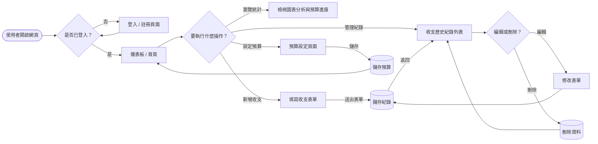
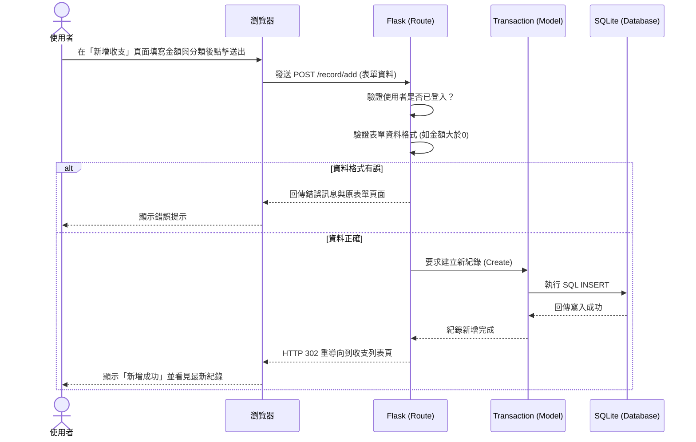

# 系統流程圖文件 (Flowchart) - 個人記帳簿

本文件依據 PRD 與架構設計，繪製出了使用者的操作流程圖以及新增一筆記帳資料的系統序列圖。

## 1. 使用者流程圖 (User Flow)

這張流程圖展示了使用者進入個人記帳簿系統後的主要操作路徑與分支畫面。

## 2. 系統序列圖 (Sequence Diagram)

這張序列圖具體描述了「使用者在畫面上新增一筆記帳紀錄」背後的系統互動流程，涵蓋從前端瀏覽器發出請求到資料庫寫入的完整細節。

## 3. 功能清單對照表

以下為本專案 MVP 及預期擴充功能的網址路由 (URL) 與 HTTP 方法對照表，作為後續 Flask 實作與 API 設計的參考依據。

| 功能名稱 | URL 路徑 | HTTP 方法 | 說明 |
| :--- | :--- | :--- | :--- |
| **登入頁面與送出** | `/auth/login` | GET / POST | 顯示登入表單 / 驗證登入資訊 |
| **註冊頁面與送出** | `/auth/register` | GET / POST | 顯示註冊表單 / 建立新帳號 |
| **登出** | `/auth/logout` | GET | 清除 Session 並導向登入頁 |
| **首頁儀表板** | `/dashboard` | GET | 顯示總收支統計、圓餅圖與預算進度 |
| **收支清單** | `/record/` | GET | 列出歷史收支紀錄 (可支援分頁/篩選) |
| **新增收支** | `/record/add` | GET / POST | 顯示新增表單 / 儲存新紀錄到資料庫 |
| **編輯收支** | `/record/edit/<id>` | GET / POST | 顯示某筆紀錄的編輯表單 / 更新該筆資料 |
| **刪除收支** | `/record/delete/<id>`| POST | 將指定 `<id>` 的收支紀錄從資料庫移除 |
| **預算設定** | `/budget` | GET / POST | 顯示預算設定表單 / 儲存月份預算設定 |
| **匯出報表** | `/export` | GET | (Nice to Have) 下載所有的收支紀錄為 CSV 檔 |
